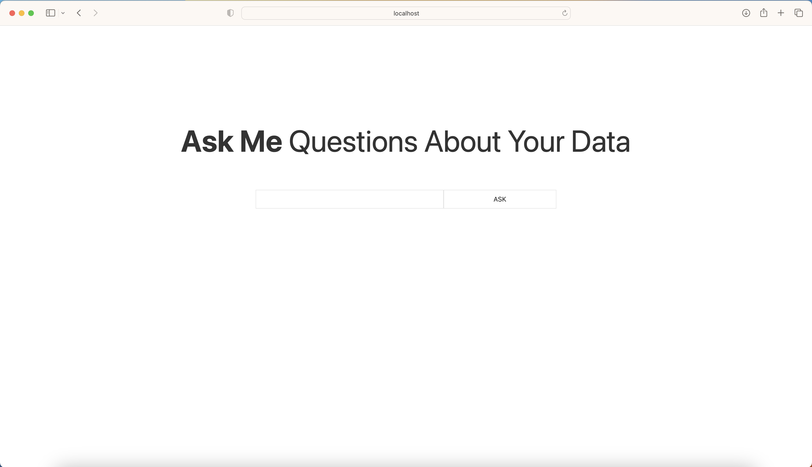
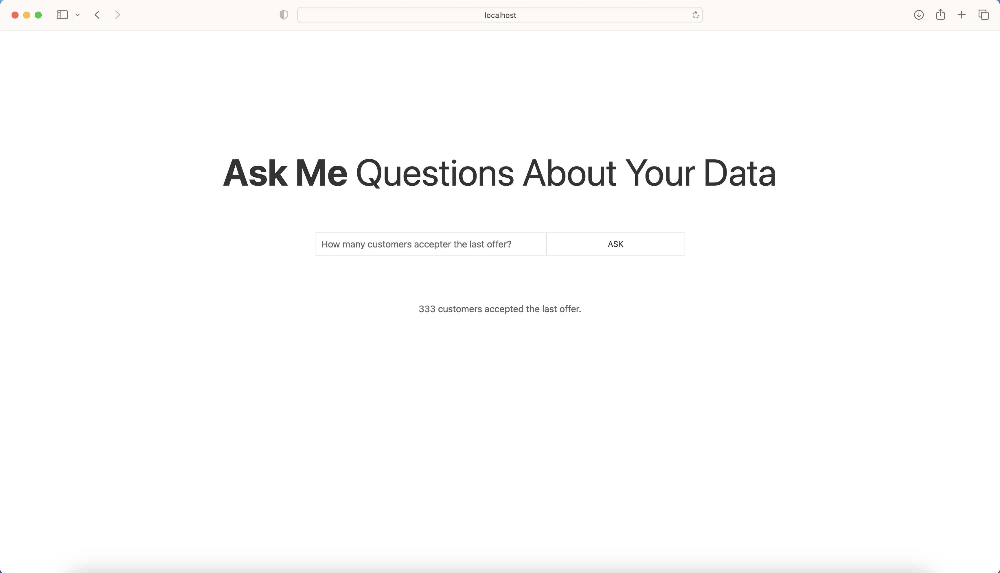

This is a [Next.js](https://nextjs.org/) project bootstrapped with [`create-next-app`](https://github.com/vercel/next.js/tree/canary/packages/create-next-app).

## Getting Started

To run the app locally, follow these steps:

1. Clone the git repository to your local machine 
2. On the terminal ```cd``` to the git repo, and run:
```bash
npm run dev
```
3. On another terminal ```cd``` to the git repo, and run the python script:
```bash
python3 api/index.py
```
4. Make sure you have an ```OPENAI_API_KEY``` environment variable set up, otherwise set it up by running:
```bash
echo "export OPENAI_API_KEY='yourkey'" >> ~/.bash_profile
source ~/.bash_profile
```
5. You can verify that you environement variable is correctly set up by running
```bash
echo $OPENAI_API_KEY
```
6. Open [http://localhost:3000](http://localhost:3000) with your browser to see the result.

The app should look like this:



And after asking a question to the chatbot, you should see the answer below


